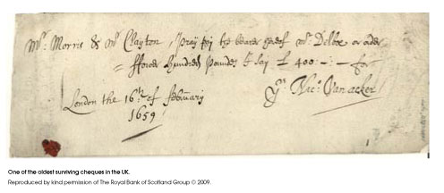

# Five Bells Demo

> This is a demo of the [Interledger](https://interledger.org) protocol. It allows you to very quickly spin up a complete Interledger network and do test transactions.
>
> Please note that this reference code is intended for TESTING USE ONLY. Do not use with real funds.

## Running the Demo

### Prerequisites

In order to try the Five Bells Demo, you need to make sure you have the following:

* [Git](https://git-scm.com/)
* [Node.js](https://nodejs.org) (Version 4.x.x or higher)

### Step 1: Clone demo

``` sh
git clone https://github.com/interledger/five-bells-demo.git
cd five-bells-demo
```

### Step 2: Install dependencies

``` sh
npm install
```

### Step 3: Run it!

``` sh
npm start
```

Visit [`http://localhost:5001`](http://localhost:5001) to see it in action!

## Why "Five Bells"?

Legend (i.e. [Wikipedia](https://en.wikipedia.org/wiki/Bankers_clearing_house)) has it that before 1770, checks/cheques were cleared by clerks running between banks exchanging checks for cash.



One day, two of the clerks from London banks recognized one another in the Five Bells Tavern on Lombard Street. The clerks started meeting daily at the Five Bells to clear checks, determine the banks' net positions and settle the remaining balances.

In the early 1800s, the group of clerks outgrew their space at the Five Bells and moved across the street to a dedicated building where check clearing would take place until the early 2000s.

## Components

This demo uses the following modules:

* [`five-bells-ledger`](https://github.com/ripple/five-bells-ledger)
* [`five-bells-trader`](https://github.com/ripple/five-bells-trader)
* [`five-bells-sender`](https://github.com/ripple/five-bells-sender)
* [`five-bells-visualization`](https://github.com/ripple/five-bells-visualization)

